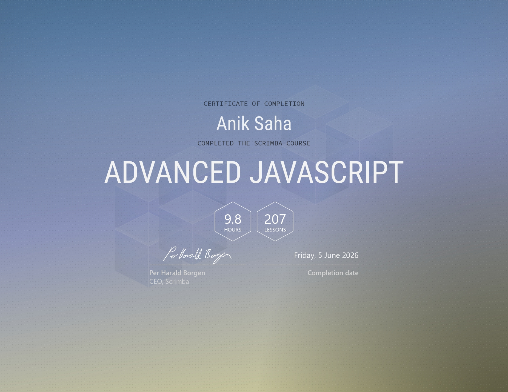
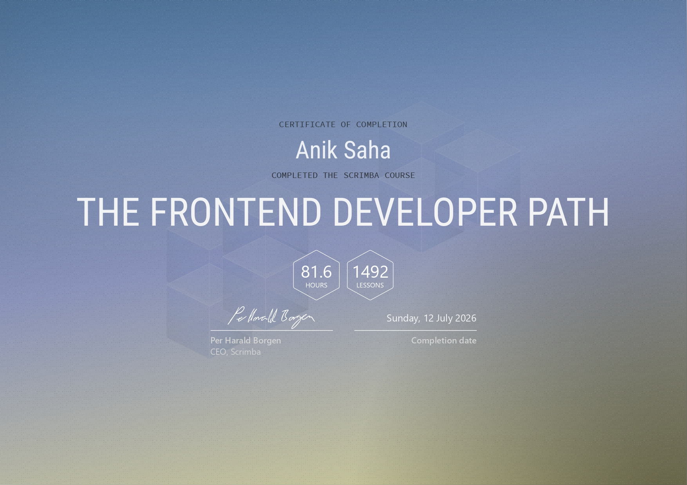

# 📜 Certificates

This repository contains certificates earned while studying frontend development, JavaScript, React, UI design, and related technologies.

My focus is not only completing courses but applying the knowledge through real-world projects available on my GitHub profile.

| Certificate                    | Provider | Skills                                                         | Status       |
|--------------------------------|----------|----------------------------------------------------------------|--------------|
| Advanced JavaScript            | Scrimba  | JavaScript, Closures, Async JavaScript, OOP                    | ✅ Completed |
| Frontend Developer Career Path | Scrimba  | HTML, CSS, JavaScript, React, Responsive Design, Git & GitHub | ✅ Completed |

---

## Advanced JavaScript

**Provider:** Scrimba

**Completed:** June 2026

### Skills Learned

- Closures
- Higher-Order Functions
- Async JavaScript
- Promises
- Event Loop
- Modules
- Object-Oriented Programming

### Certificate Preview

  

📄 **Full Certificate:** [PDF](./scrimba/Advanced%20JavaScript%20Tutorial_%20Learn%20to%20master%20complex%20concepts%20through%20this%20hands-on%20course%20with%20Tom%20Chant.pdf)

---

## Frontend Developer Career Path

**Provider:** Scrimba

**Completed:** July 2026

### Skills Learned

- HTML5 & Semantic HTML
- CSS3 & Responsive Design
- Flexbox & CSS Grid
- JavaScript (ES6+)
- Advanced JavaScript
- Asynchronous JavaScript & APIs
- React Fundamentals
- React Hooks & State Management
- Responsive Web Design
- UI/UX & Accessibility Best Practices
- Git & GitHub
- Deployment & Modern Frontend Workflow

### Certificate Preview

  

📄 **Full Certificate:** [PDF](./scrimba/The%20Front-End%20Developer%20Career%20Path_%20Learn%20the%20skills%20you'll%20need%20to%20launch%20your%20career%20in%20web%20development.pdf)

### Related Projects

- Movie Watchlist
- Tenzies
- Assembly Endgame
- Quizzical
- Component Library++
- Unit Converter
- Password Generator
- Color Scheme Generator
- Personal Dashboard
- Basketball Scoreboard